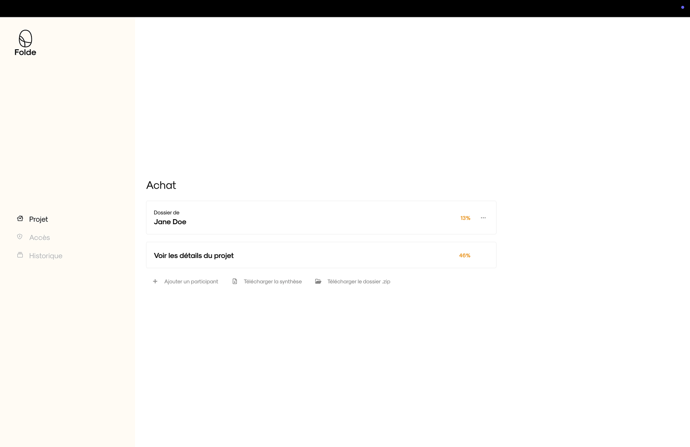
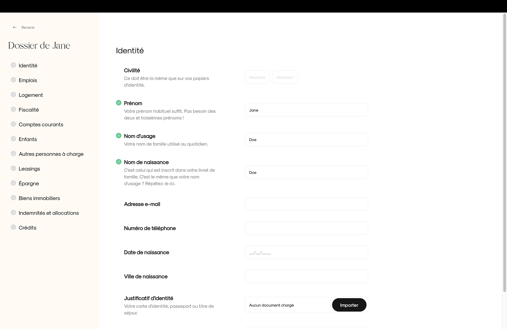
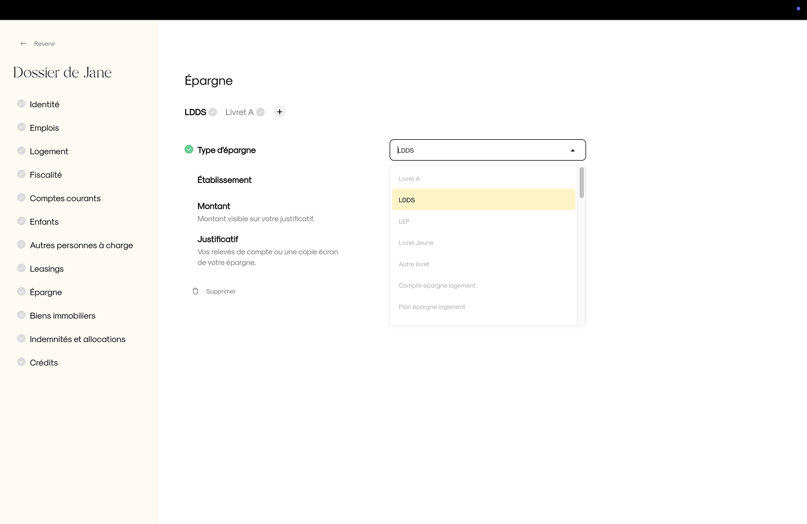
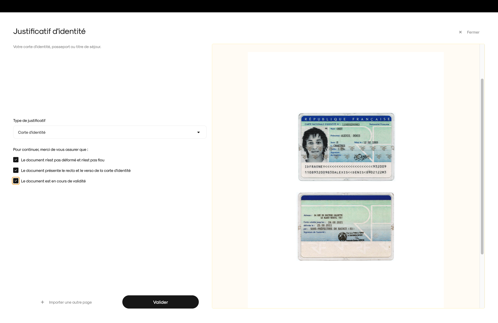
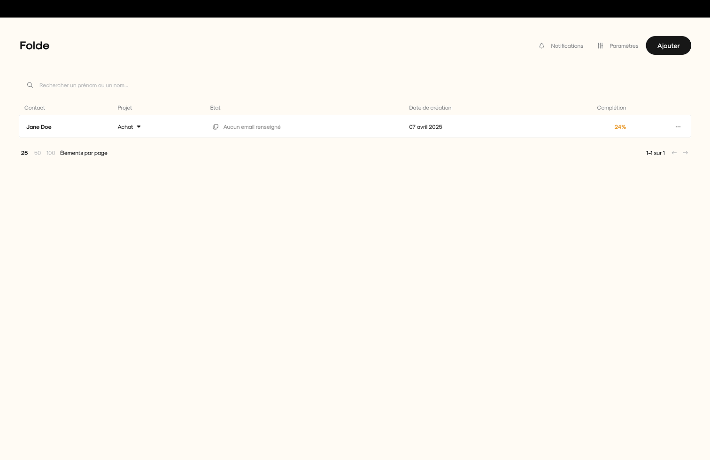
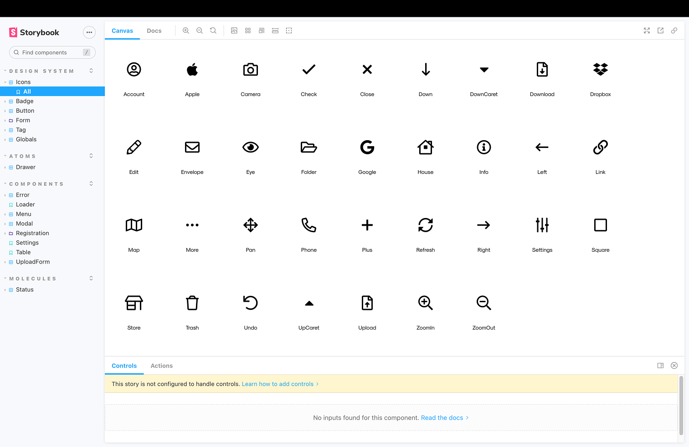
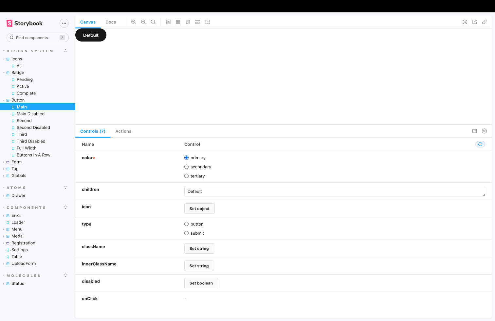
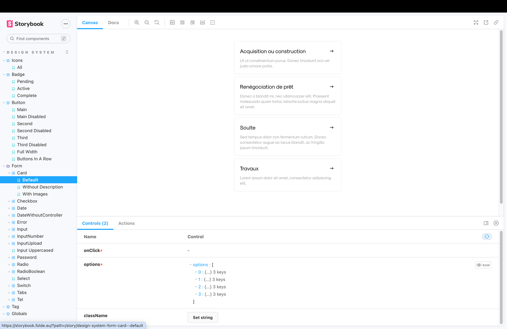
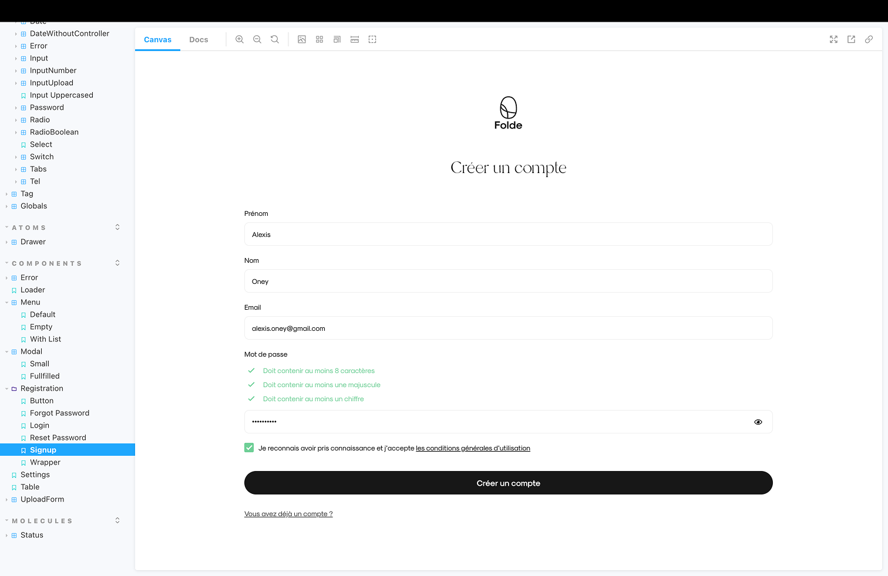

# Folde

**Rôle** :

- Année 1 : Fullstack Developer & Scrum Master
- Années 2 et 3 : Frontend Developer & Scrum Master

**Technos** : Next.js (SPA), TypeScript, React Hook Form, React Query, Jest, Storybook, FaunaDB, Firebase + Google Cloud Storage

### 🔍 Contexte

Folde est une plateforme conçue pour simplifier la constitution des dossiers de prêt immobilier. Co-fondée par les fondateurs de Pelostudio et un courtier expérimenté, elle vise à remplacer les échanges d’e-mails désorganisés et peu sécurisés par un outil centralisé, collaboratif et adapté aux besoins des courtiers.

Le secteur étant encore très dépendant des échanges manuels, Folde permet de :

- Suivre facilement la complétude d’un dossier,
- Gérer plusieurs co-emprunteurs,
- Faciliter le travail en équipe (assistants, groupements de courtiers),
- Garantir la sécurité et la confidentialité des documents partagés.

### 🎯 Objectifs

- Année 1 : Créer un MVP pour acquérir les premiers clients, le tout en parallèle d'autres projets chez Pelostudio.
- Années 2 et 3 : Faire évoluer l’app avec une nouvelle stack backend et de nouvelles features.

---

## 👨‍💻 Mon rôle

### Année 1 — Fullstack Developer & Scrum Master

- Développement complet du MVP (frontend & backend) :
  - Frontend : Next.js SPA + TypeScript, React Query, React Hook Form
  - Backend : FaunaDB et Firebase Auth & Storage (hébergé sur Google Cloud).
- Conception des interfaces avec Storybook en lien avec le design sur Figma.
- Tests unitaires via Jest.
- Animation de l’équipe autour d’une méthode agile : board Linear, rédaction des user stories, planning poker, rituels (daily & rétro).

### Années 2 et 3 — Frontend Developer & Scrum Master

- Intégration d’un CTO (recruté avec l’aide du prestataire backend).
- Collaboration avec un prestataire backend pour une refonte de l’architecture : nouvelle API en Ruby on Rails + PostgreSQL + AWS S3.
- Reconnexion un à un des endpoints frontend vers cette nouvelle API
- Maintien des rituels agiles tout au long du projet.

---

## 🧩 Défis techniques & solutions

### 💡 Formulaires complexes & UX

- Mise en place d’une librairie de composants interne, avec des éléments adaptés à l’usage métier (formatage intelligent des dates, gestion dynamique de pièces jointes, etc.).
- Utilisation poussée de React Hook Form pour gérer la logique conditionnelle, les validations et le rendu dynamique des champs.
- Système d’auto-save pour éviter la perte de données, indispensable dans des formulaires longs.

### 📲 Responsiveness & expérience utilisateur

- L’app devait s’adapter aux usages distincts : desktop pour les courtiers, mobile pour les clients.
- Design system et composants en étroite relation avec le fonctionnement de Figma.

### 🔀 State Management

- Utilisation de React Query comme state manager principal, permettant une synchronisation 1:1 avec l’API.

---

## 🛠️ Stack technique & choix

| Outil           | Pourquoi ?                                           |
| --------------- | ---------------------------------------------------- |
| Next.js (SPA)   | Framework robuste pour scaler                        |
| TypeScript      | Sécurité du typage, prévention des erreurs courantes |
| React-Hook-Form | Parfait pour la gestion de formulaires complexes     |
| React Query     | Gestion centralisée des appels API et du cache       |
| Storybook       | Documentation UI + collaboration avec le designer    |
| FaunaDB         | Solution rapide pour démarrer, dashboard intégré     |
| Firebase & GCS  | Auth & stockage cloud sécurisés, rapide à déployer   |

---

## 📈 Résultats

- +100 courtiers utilisateurs actifs
- +3 000 dossiers créés sur la plateforme
- Design System et composants réutilisables

---

## 🤓 Ce que j’ai appris

- FaunaDB a montré ses limites : bien que pratique au départ, il s’est révélé peu adaptée à la montée en complexité du projet car trop propriétaire.
- Next.js en SPA était sans doute trop lourd pour les besoins réels de l’app : les bénéfices apportés par le framework ne compensaient pas la complexité qu’il ajoutait.
- Être au contact des fondateurs m’a permis de mieux comprendre les mécaniques SaaS : investissement, roadmap produit, pricing, arbitrage entre rapidité et robustesse.
- J’ai découvert la stack Ruby on Rails, sans contribuer directement côté backend, mais en comprenant sa structure et son impact sur le développement frontend.
- J’ai animé une équipe produit en mettant en place une méthodologie agile claire et efficace, issue de mon expérience acquise sur des projets précédents.

---

## 🖼️ Aperçus

