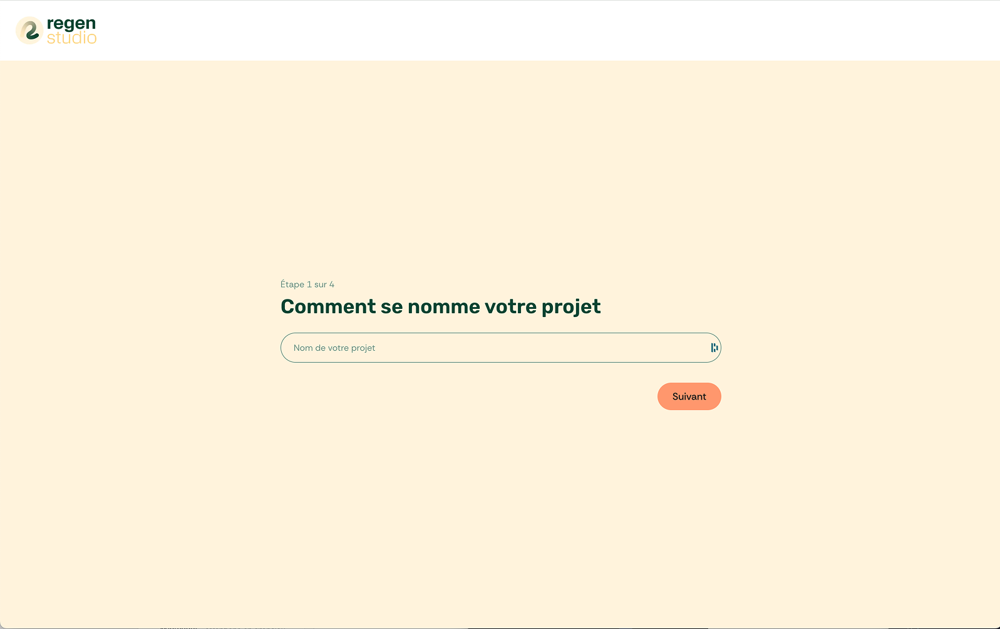
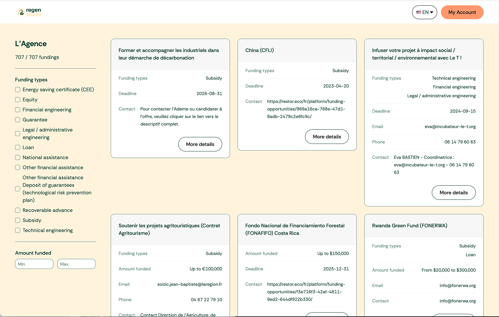
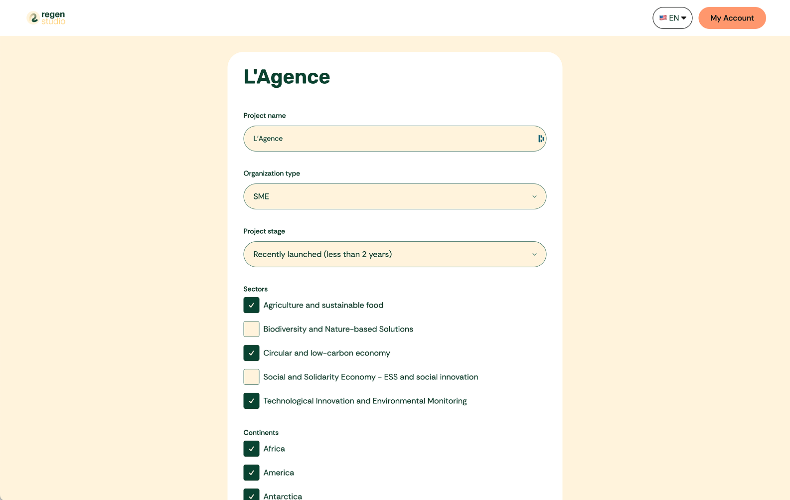

# Regen Studio

Rôle : Fullstack Developer, Designer, Product Facilitator

Technos : React, TypeScript, Vite, Tailwind CSS, i18next, React Router, Zod, Express, Supabase, Airtable API, Figma

---

### 🔍 Contexte

Regen Studio est une plateforme conçue pour aider les porteurs de projets éco-responsables à identifier rapidement les financements (subventions, investissements, appels à projets…) adaptés à leur besoin.

Le projet est né de l’expérience de [Sofyan Martin](https://www.linkedin.com/in/sofyan-martin-59242285/), qui accompagne quotidiennement ces porteurs de projets. Son temps étant limité, il souhaitait créer un outil digital accessible par abonnement, afin de :

- Proposer une short list personnalisée de financements à partir d’une base de données de +1700 dispositifs,
- Offrir un accès autonome aux utilisateurs,
- Identifier plus facilement des projets à fort potentiel pour les accompagner individuellement.

Aujourd’hui, la V1 est en ligne, et une V2 — avec dashboard, gestion de compte et paywall — est sur le point d’être lancée. Sofyan est en discussion avec la BPI pour soutenir le développement du projet.

---

### 🎯 Objectifs

- Créer un formulaire de qualification intelligent pour identifier les financements adaptés.
- Rechercher et filtrer dans une base de données Airtable les financements correspondants.
- Préserver Airtable comme outil de gestion interne (par le client et ses partenaires).
- Concevoir une expérience UX fluide et responsive, accessible en multilingue.

---

## 👨‍💻 Mon rôle

- Design UX/UI complet dans Figma (formulaire, dashboard).
- Développement fullstack :
  - Frontend (React, TypeScript, Tailwind, i18next, React Router)
  - Backend léger via Express (couche au-dessus de l’API Airtable)
  - Authentification avec Supabase
  - Validation avec Zod
- Création d’une librairie de composants spécifiques au projet
- Structuration de la base Airtable en collaboration avec Sofyan
- Gestion de projet (kanban Notion, roadmap, priorisation des tickets devs)
- Collaboration avec un expert scraping & deux project managers

---

## 🧩 Défis techniques & solutions

### 🧠 Simplicité

- Conserver Airtable comme outil cœur de gestion pour le client
- Créer une surcouche en Express comme API endpoint

### 💡 UX from scratch

- Formulaire avec champs conditionnels et UX intuitive
- Dashboard simple, responsive et clair
- Multilingue avec i18next

### 🧰 “Boring Stack”

- Après plusieurs essais (Ruby on Rails, Web Components…), je suis revenu à une stack simple :
  - Vite
  - React
  - TailwindCSS
  - Express

---

## 🛠️ Stack technique & pourquoi

| Outil        | Pourquoi ?                                      |
| ------------ | ----------------------------------------------- |
| React + Vite | Stack légère et rapide                          |
| TypeScript   | Pour la sécurité et la maintenabilité           |
| TailwindCSS  | Pour un design rapide et responsive             |
| React Router | Simplicité, pas besoin d’un meta-framework      |
| i18next      | Pour la gestion multilingue                     |
| Express      | Back-end léger, juste une surcourche à Airtable |
| Zod          | Validation côté API                             |
| Supabase     | Authentification simple et rapide               |

---

## 📈 Résultats

- V1 en production, V2 bientôt live : https://app.regenstudio.co/
- 1700 financements référencés
- 30 projets analysés dans la V1
- 5 beta-testeurs actifs sur la V2

---

## 🤓 Ce que j’ai appris

- J’ai tenté plusieurs approches (Rails, Vanilla JS + Web Components) avant de revenir à une solution éprouvée. Ce choix a maximisé ma productivité.
- Ce projet m’a aussi permis d’approfondir ma capacité à justifier mes choix tech et à les assumer.
- L’efficacité produit vient souvent de la simplicité dans les fondations techniques.

---

## 🖼️ Aperçus

